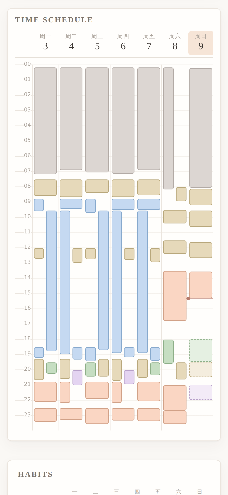
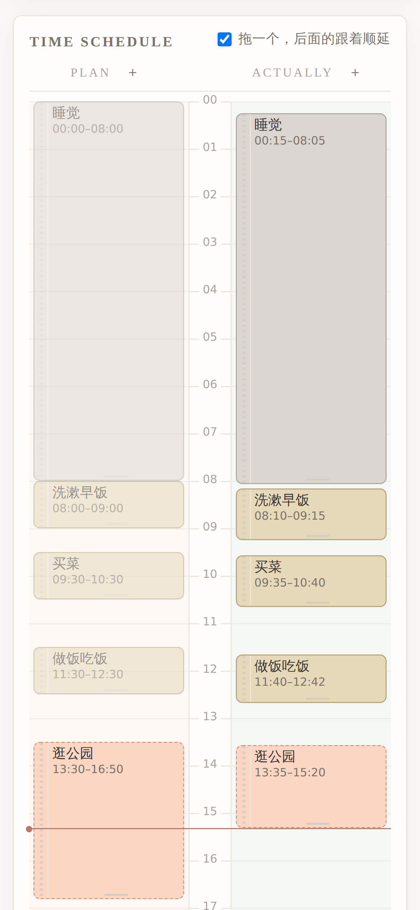
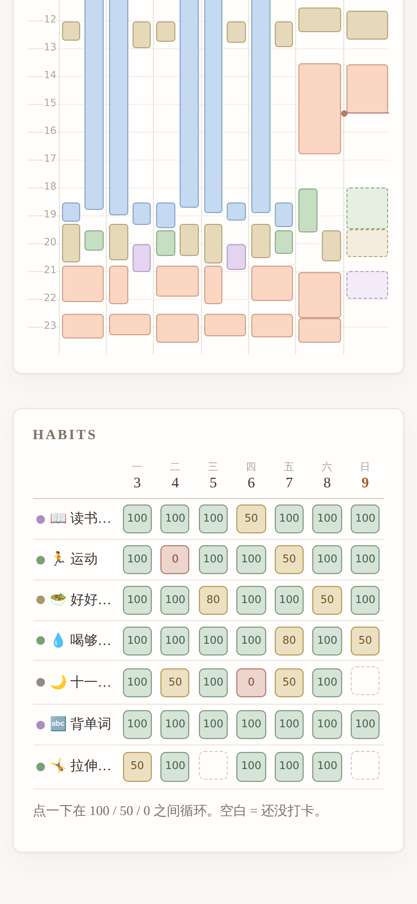
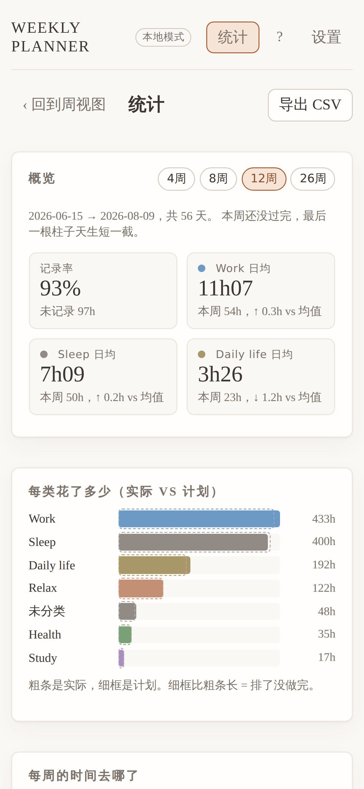

# Weekly Planner

[中文](README.md) · **English**

A weekly planner I built for myself. The left column is **what you meant to do**, the
right is **what you actually did**, and at the end of the week it tells you where the
hours went.

No AI scheduling, no notifications, no nagging. It is a paper planner that happens to
be electronic.

| Week | Day | Habits | Stats |
|---|---|---|---|
|  |  |  |  |

> Everything in the screenshots is made-up sample data.

The app is bilingual — it follows your browser language and can be switched in
Settings.

---

# For people who want to use it

## What it does

- **Two columns per day**: Plan on the left, Actual on the right. You never rewrite the
  plan; you just log what happened, and the gap between them is visible at a glance.
- **To-dos can be “scheduled”**: write “groceries, 40–60 min” and one tap drops it into
  the first gap of the day that fits. If nothing fits, it tells you how many minutes
  short you are.
- **Habit tracking**: one row per habit, one column per day, tap to cycle 100 / 50 / 0.
- **Stats**: totals by category (sleep / work / study / daily life / relax / health),
  daily averages, min and max, weekly trend, and CSV export for a spreadsheet.
- **Works on a phone**: add it to your home screen and it behaves like an app —
  full screen, its own icon.

What it deliberately **does not** do: no notifications, no due-date reminders, no
priority sorting. Things you would forget without a nudge — filing taxes, a certificate
expiring — belong in a calendar or a notes app. This one answers “did I do these today,
and where did the time go”. It records; it does not remind.

## Is there something I can just download and run?

No — it is a **web app**, not a program you install, so there is no `.exe` and nothing
in an app store. The upside is that there are no versions, updates or OS requirements
to worry about.

The trade-off is that it has to run somewhere. This setup is free:
**Vercel** serves the page, **Supabase** stores the data. For one person, both free
tiers are far more than enough. Set it up once and it syncs between your phone and
your computer.

## Set up your own copy (about 15 minutes)

No coding required, but you do have to click around two websites. Just follow along.

### Step 1: create the database (Supabase)

1. Sign up at [supabase.com](https://supabase.com), click **New project**, pick a
   region near you. Save the database password somewhere.
2. In the left menu open **SQL Editor** → New query.
3. Copy the whole of [`db/schema.sql`](db/schema.sql) from this repo, paste it in and
   press Run. “Success” means every table is in place.
4. Go to **Project Settings → API** and note two values for the next step:
   - **Project URL** (looks like `https://xxxx.supabase.co`)
   - the **anon public** key (a long string)
   > ⚠️ Do not use the `service_role` key next to it — that is the admin key and must
   > never go into a web page.

### Step 2: turn on a way to sign in

In **Authentication → Providers**, enable one of:

- **Email** (simplest): sign in with a link sent to your inbox, no password to remember.
- **Google**: nicer to use, but you have to create an OAuth client in Google Cloud first.

Then, once you have signed in yourself, **turn off “Allow new users to sign up”**
in Authentication → Sign In / Providers. Otherwise anyone who knows your URL can create
an account inside your database.

### Step 3: deploy (Vercel)

This button copies the repo to your own GitHub account and asks for the two values from
step 1:

[](https://vercel.com/new/clone?repository-url=https%3A%2F%2Fgithub.com%2Fleeqcn%2Fweekly-planner&env=VITE_SUPABASE_URL,VITE_SUPABASE_ANON_KEY&envDescription=Your%20Supabase%20Project%20URL%20and%20anon%20public%20key&project-name=weekly-planner&repository-name=weekly-planner)

- `VITE_SUPABASE_URL` → the Project URL
- `VITE_SUPABASE_ANON_KEY` → the anon public key

A minute or two later Vercel gives you a URL like
`https://weekly-planner-xxx.vercel.app`.

### Step 4: tell Supabase about that URL (skip this and you cannot sign in)

Back in Supabase → **Authentication → URL Configuration**:

- **Site URL**: the URL Vercel gave you
- **Redirect URLs**: add `https://your-url.vercel.app/**` (do not drop the two stars)

Supabase only accepts redirect targets on that allow-list. Anything else is silently
ignored, which shows up as clicking a sign-in link and never coming back.

Open the URL, sign in, and you are running.

## Add it to your phone’s home screen

Open your URL in the phone browser:

- **iPhone**: Safari → Share → Add to Home Screen
- **Android**: Chrome → menu → Install app

After that it opens full screen, like an installed app.

## Questions people ask

**Does it cost anything?**
No. The Vercel and Supabase free tiers are far more than one person’s schedule needs.
The one thing to know: a free Supabase project **is paused after about a week of
inactivity** — one click in the dashboard brings it back, and nothing is lost.

**Where does my data live? Can anyone else see it?**
In your own Supabase project. Every table has row-level security: **only you, signed
in, can read or write your rows**, and someone who is not signed in cannot read a
single row. I cannot see your data either — your database has nothing to do with me.

**Can I try it without setting up those two sites?**
Yes. Download the repo, install [Node.js](https://nodejs.org) and run:

```bash
npm install
npm run dev
```

Nothing to configure. Data is kept in your browser (so it does not sync between
devices and clearing site data wipes it), which is fine for deciding whether you like
it.

**I forgot how something works.**
There is a **?** in the top-right corner of the app — every gesture and feature is in
there, in whichever language the app is showing.

**Can I change it to suit me?**
Yes — MIT licence, do what you like. Developer notes are below.

---

# For developers

```bash
npm install
npm run dev      # runs without Supabase, on localStorage sample data
npx oxlint src/  # lint
npm run build
```

With no `.env.local` the app starts in “local mode”: data in localStorage plus a set of
sample templates. If Supabase is configured but you want the fake data back while
working on the UI, add `VITE_USE_MOCK=1` to `.env.local`.

## Database

A fresh project only needs [`db/schema.sql`](db/schema.sql) — seven tables, indexes,
constraints and RLS, safe to run more than once.

> It is not hand-maintained guesswork: it was diffed item by item against the result of
> running `db/0001`–`0010` in order on an empty database — 134 structural items
> (columns, constraints, indexes, RLS flags, policies) match exactly. The policies were
> also exercised on a real Postgres: another user reads none of your rows, writing under
> someone else’s `user_id` is rejected by the policy, and the anonymous role reads
> nothing at all.

An **existing** database should apply whichever of `db/0001`–`0010` it is missing, in
order. Each is idempotent; see the Chinese README for what each one does.

### About the anon key

It is compiled into the front-end bundle and **anyone who opens the site can read it**.
That is by design, not an oversight. What actually protects the data is RLS: every table
is “authenticated role only, and only rows whose `user_id` is yours”, with no policy at
all for the anonymous role. Never put a `service_role` key in the front end or commit
one — that key bypasses RLS.

### Sign-in / Redirect URLs

Google sign-in with email magic links as a fallback. **Supabase only honours redirect
targets on the allow-list**; anything else is silently ignored and you land on the Site
URL. Add all of these under Authentication → URL Configuration → **Redirect URLs**:

```
http://localhost:5173/**
https://<your Vercel domain>/**
https://<project>-*.vercel.app/**    # preview deploys, optional
```

## Internationalisation

- UI strings go through `tr('中文原文')` in `src/lib/i18n.js` — the Chinese source
  string *is* the key, so a missing translation falls back to Chinese instead of
  breaking, and the code stays readable.
- Strings with a value in the middle use `pick(() => zh, () => en)`.
- The help page is not translated string by string: `HelpZh.jsx` and `HelpEn.jsx` are
  written separately, because a sentence-by-sentence translation of a whole document
  reads badly in both languages.
- Language follows `navigator.language` on first run and can be changed in Settings.

## Design notes

The long-form notes — why the timeline draws actual for finished entries and plan for
unfinished ones, why deletion leaves a tombstone, why the palette was measured rather
than picked, how the stats rollup survives the 28-day purge — are in the
**[Chinese README](README.md)**, which is the working document for this project. They
have not been translated; if you are digging into the code and need one of them in
English, open an issue and I will translate that section.

## Licence

[MIT](LICENSE). Use it, change it, ship it; no warranty.
